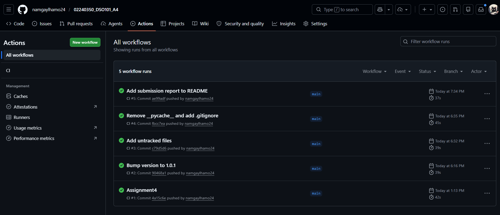
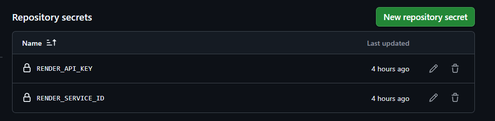
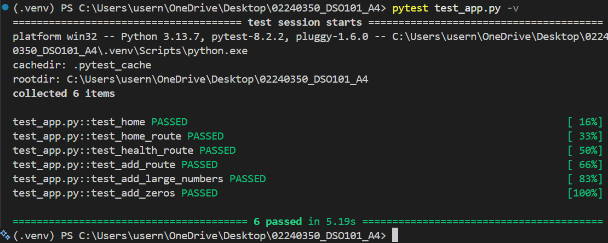
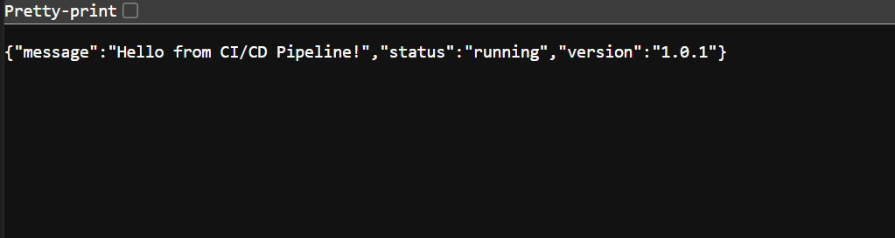
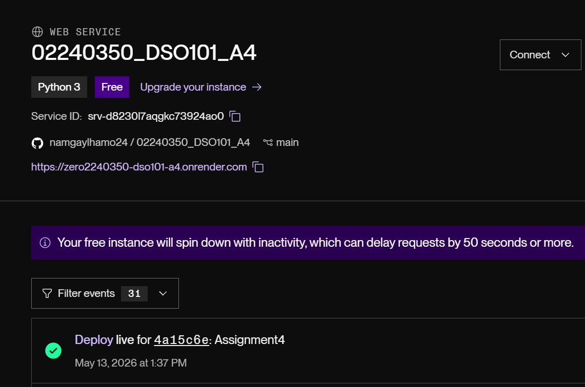

# Assignment IV — Build a Complete CI/CD Pipeline with Testing & Deployment
---

## 1. Introduction

This report documents the implementation of a complete CI/CD pipeline for a backend web application. The pipeline automates building, testing, and deploying the application on every push to `main`. The tools used in this project are GitHub (source control), GitHub Actions (CI/CD), Render (deployment), and `pytest` (unit testing).

---

## 2. Project Structure

Project layout (repo root):

```
02240350_DSO101_A4/
├── app.py
├── test_app.py
├── requirements.txt
├── render.yaml
├── .github/
│   └── workflows/
│       └── ci.yml
└── screenshots/
  ├── github-action-secretrepo.png
  ├── render-deploy.png
  ├── test1.png
  └── test2.png
```

- `app.py` — Flask backend application (returns JSON at `/`).
- `test_app.py` — `pytest` tests (6 tests).
- `requirements.txt` — Python dependencies.
- `render.yaml` — Render service config (start command uses `gunicorn`).
- `.github/workflows/ci.yml` — GitHub Actions workflow that runs tests and triggers Deploy to Render.

---

## 3. Backend Application

The backend is a small Flask app that returns JSON on the root route. Current `app.py` (summary):

```python
from flask import Flask, jsonify

app = Flask(__name__)

@app.route("/")
def home():
  return jsonify({
    "message": "Hello from CI/CD Pipeline!",
    "status": "running",
    "version": "1.0.1"
  })

@app.route("/health")
def health():
  return jsonify({"status": "healthy"}), 200

@app.route("/add/<int:a>/<int:b>")
def add(a, b):
  return jsonify({"result": a + b})

if __name__ == "__main__":
  app.run(host="0.0.0.0", port=5000)
```

---

## 4. Unit Testing

Unit tests are implemented with `pytest`. The repository contains six tests that run locally and in CI (all passing):

- `test_home` — basic arithmetic sanity check (`1 + 1 == 2`).
- `test_home_route` — GET `/` returns 200 and JSON with `message` and `status`.
- `test_health_route` — GET `/health` returns 200 with `{"status":"healthy"}`.
- `test_add_route` — GET `/add/3/7` returns `{"result":10}`.
- `test_add_large_numbers` — addition for larger integers.
- `test_add_zeros` — addition with zeros.

These tests run with the provided `test_app.py` and currently pass locally and in CI.

Example local run:

```bash
pytest test_app.py -v
# → 6 passed
```
---

## 5. CI/CD Pipeline

The GitHub Actions workflow is located at `.github/workflows/ci.yml`. It runs tests and (when on `main`) triggers a Deploy job that posts to the Render API. Key points:

- Uses `actions/setup-python@v4` with Python 3.9.
- Caches pip packages for speed.
- Runs `pip install -r requirements.txt` and `pytest -q`.
- `deploy` job: when the branch is `main`, it POSTs to Render's deploy endpoint using `RENDER_API_KEY` and `RENDER_SERVICE_ID` from GitHub Secrets.

This is the actual `deploy` step in the workflow (summary):

```bash
curl -s -X POST "https://api.render.com/v1/services/${RENDER_SERVICE_ID}/deploys" \
  -H "Authorization: Bearer ${RENDER_API_KEY}" \
  -H "Content-Type: application/json" \
  -d '{"clearCache": true}'
```

### Screenshot — GitHub Actions Workflow Run



---

## 6. Deployment

Deployment notes — `render.yaml`:

```
service: web
name: flask-ci-cd-app
env: python
buildCommand: pip install -r requirements.txt
startCommand: gunicorn app:app
runtime: python3
```

Note: the live service on Render uses `gunicorn app:app` as the start command (not `python app.py`).

### Screenshots / Test output







---

## 7. Conclusion

The repository implements a working CI/CD flow: on push, GitHub Actions installs dependencies, runs `pytest` (6 tests), and—when on `main`—the workflow triggers a Render deploy via API. The Flask app responds with JSON at `/`, `/health`, and `/add/<a>/<b>` and the deployment configuration in `render.yaml` uses `gunicorn` to run the app.

---

